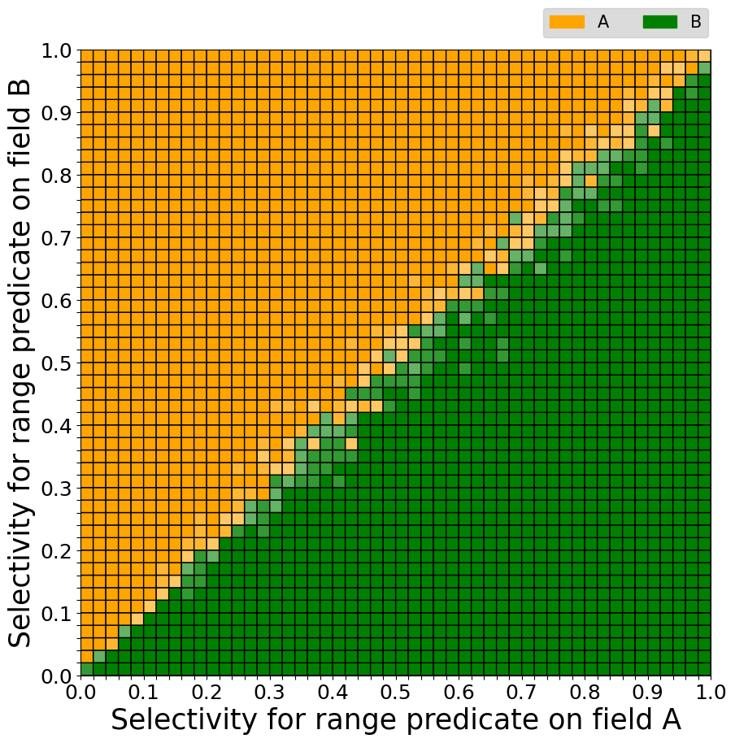

Visualize Ties
===
For each pixel in the visualization reflects a conclusion of multiple experiments. 

The graph reflecting the query plan selected by MongoDB is obtained by a majority 
vote of the results of multiple experiments. The number of experiment is controlled 
by `REPITITION` option as stated in this [document](./run-experiment.md). 

The graph reflecting the real best query plans is obtained by compering the average
execution time of different query plans. The color of a pixel represents the
query plan that has the shortest average execution time.

Methodology
----
We use color saturation to reflect how good the choice is compared to the suboptimal choice.
As mentioned above, we use different techniques to visualize MongoDB chosen plans and the truly 
optimal query plan. We have to use different methods to visualize ties of these two kinds
of graph. 

The first type of graph visualize MongoDB's chosen plans. To visualize ties in this
type of graph, we first calculate:

```
alpha = number of votes that agree on the choice / total number of votes
```

Then we use alpha value of each pixel to generate a mask for the original plot. Finally, the mask
is applied on the original plot. The greater the alpha value, the more concrete the color of the pixel, otherwise the color
fade away. Here is an example of the first type of graph:



The second type of graph visualize the really optimal query plans. To visualize ties in this
type of graph, we calculate:

```
alpha = the average execution time of the optimal plan / the average execution time of the second best plan
```

The greater the alpha value, the be more concrete the color of the pixel, otherwise the color
fade away. Here is an example of the second type of graph:


The white area in both graph indicates that the chosen plan is not competitive in the corresponding cases.

How To Run The Code
----
Go to main function of `processing/visualize_ties_v2.py`

Make sure 
1. `processed_grid_path` is set to `result_dir/COLLECTIONNAME` 
2. `intermediate_grid_path` is set to `grid_dir/COLLECTIONNAME`

Run

    $ python3 processing/visualize_ties_v2.py

Results will be saved in `processing/` 

Naming convention of result figures:
* Ties in MongoDB's chosen plans: `mongo_choices_show_ties.png`
* Ties in optimal plans: `optimal_plans_show_ties.png`