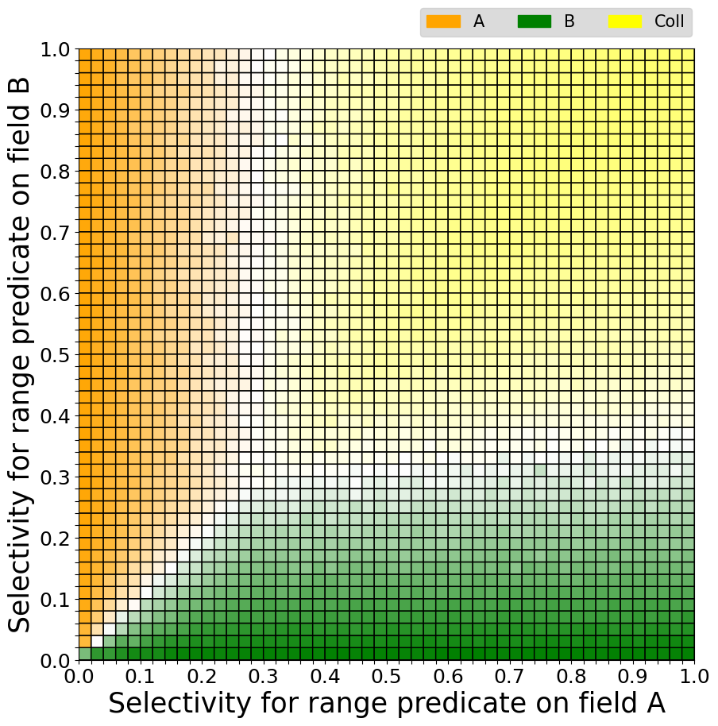

Final Report
====


Project Scope
----
Carry out empirical work that extends the research work of my honours thesis: 
[Overleaf Link](https://www.overleaf.com/9886178511bnfhsqfvvmfv)

Tasks include coding experimental harnesses, applying additional workloads 
to installations of MongoDB on cloud-hosted services, measuring query execution
time, visualizing ties of query plan choices, analysis overhead of the FPTP approach,
storage of code data and outcomes in appropriate stores, and producing reports
and charts on the results.


Contributions
----
The results and findings of this project have the following contributions towards
 understanding the nature of the MongoDB query optimizer:

* I made a VLDB submission
    * [Overleaf Link](https://www.overleaf.com/4849921368dtjgrhckpjcy)
    * [Latex code and .pdf file](./vldb-submission-latex)
* In the above submission, I propose an innovative way to evaluate and visualize the impact on query performance
of an optimizer’s choices.  By using this approach, I identify places where the MongoDB 
query optimizer chooses sub-optimal query plans. My approach could form the basis of an 
automated regression testing tool to verify that the query planner in MongoDB improves
 over time. 
* I identify causes of the preference bias of FPTP, in which index scans are systematically 
chosen even when a collection scan would run faster. I fix the problem. Different versions 
of the MongoDB source code are available for download and inspection.
* The query plan visualization tool can visualize ties (i.e. query plans with similar execution time)


Query Plan Evaluation Tool
====


GitHub Link
----
[Code for all experiments and results](https://github.com/DaweiTao/mongodb-query-optimizer-evaluation-tool)


Description
----
This tool aims at evaluating the effectiveness of Mongodb query optimizer. We define query optimizer 
effectiveness as the capability of the query optimizer to consistently choose the best execution plan 
among all alternatives. This tool is capable of...

* Populate a MongoDB database with customizable workload.
* Visualize MongoDB's choices of query plan and their performance.
* Visualize ties (i.e. query plans that has similar execution time)
* Visualize the overhead of the FPTP query optimization.


How To Run The Code
----
Please follow the steps below to run the code. Please note that some steps cannot be skipped.
It is **strongly recommended** to execute the code step by step according to the instructions. 
Otherwise, you may encounter errors. 

1. Deploy different versions of MongoDB on AWS instances. (Includes links to modified MongoDB source code)
2. Prerequisites and suggested settings.
3. Run the experiment which visualize query plans and their performance.
4. Visualize ties (i.e. query plans that has similar execution time).
5. Measure overhead and evaluate results.


Deploy MongoDB On AWS Instances
====
For this project, it is recommended to deploy different versions of MongoDB on different AWS instances.
This document provide all the details of how to compile MongoDB source code and deploy the build
on the AWS instance. 

Where to Get Source Code
----
We use three different versions of MongoDB for the experiment, including v4.4.0 release and two other modifed versions:

* V0: the original MongoDB v4.4.0 release
    * `$ wget https://fastdl.mongodb.org/linux/mongodb-linux-x86_64-amazon2-4.4.0.tgz`
* V1: we add collection scan to query plan candidates (based on MongoDB v4.4.0 source code)
    * [V1 release](https://github.com/DaweiTao/mongo/releases/tag/v4.4.0-collscan-added)
* V2: we adjust the productvity of all fetch operations (based on MongoDB v4.4.0 source code)
    * [V2 release](https://github.com/DaweiTao/mongo/releases/tag/v4.4.0-fptp-mod)

The query optimizer of MongoDB V0 never chooses collection scan. Because collection
 scan is not in the query plan candidates. In V1 we add collection scan to query plan candidates. The query optimizer 
considers collection scan as a query plan candidate, but it never chooses collection scan. We find that
the query optimizer has a preference bias towards fetch operations.
Therefore, in V2 we penalize the productivity score of all fetch operations. As a result, the preference
bias problem is fixed. 

AWS Instance Minimum Requirement
----
| Instance Size | vCPU | Memory (GiB) | Instance Storage(GiB) |
|---------------|------|:------------:|-----------------------|
| t2.xlarge     | 4    | 16           | 50                    |

**Note**: SSD is recommended. 

Building MongoDB From Source 
----
To build MongoDB, you will need:
* A modern C++ compiler capable of compiling C++17. One of the following is required:
    * GCC 8.2 or newer
    * Clang 7.0 (or Apple XCode 10.2 Clang) or newer
    * Visual Studio 2019 version 16.4 or newer (See Windows section below for details)
* On Linux and macOS, the libcurl library and header is required. MacOS includes libcurl.
    * Fedora/RHEL - `dnf install libcurl-devel`
    * Ubuntu/Debian - `libcurl-dev` is provided by three packages. Install one of them:
      * `libcurl4-openssl-dev`
      * `libcurl4-nss-dev`
      * `libcurl4-gnutls-dev`
* Python 3.7.x and Pip modules:
  * See the section "Python Prerequisites" below.
* About 13 GB of free disk space for the core binaries (`mongod`,`mongos`, and `mongo`) and about 600 GB for the install-all target.

Scons Prerequisites
----
To install lzma dlevel （Devel libraries & headers for liblzma) on Linux, run:

    $ yum install -y xz-devel

Install mongod
----
Upgrade g++ version:
* Check [this guide](https://medium.com/@bipul.k.kuri/install-latest-gcc-on-centos-linux-release-7-6-a704a11d943d)
for more information
* If the mirror in the article doesn't work, try this one:\
https://ftp.gnu.org/gnu/gcc/gcc-8.2.0/gcc-8.2.0.tar.gz
* All steps together (shell script):
```
#!/bin/sh
GCC_VERSION=8.2.0
sudo yum -y update
sudo yum -y install bzip2 wget gcc gcc-c++ gmp-devel mpfr-devel libmpc-devel make
gcc --version
wget http://gnu.mirror.constant.com/gcc/gcc-$GCC_VERSION/gcc-$GCC_VERSION.tar.gz
tar zxf gcc-$GCC_VERSION.tar.gz
mkdir gcc-build
cd gcc-build
../gcc-$GCC_VERSION/configure --enable-languages=c,c++ --disable-multilib
make -j$(nproc)
sudo make install
gcc --version
cd ..
rm -rf gcc-build
```

Install install libcurl, run:

```
$ yum install -y curl-devel
$ yum install -y openssl-devel
```

Install lzma dlevel (Devel libraries & headers for liblzma), run:

    $ yum install -y xz-devel

Build from source code, run:

    $ python3 buildscripts/scons.py -j4 --disable-warnings-as-errors install-core

**Note**: We need **mongod** and **mongo**. The following targets can be named on the scons command line to build
only certain components:

* `install-mongod` 
* `install-mongos`
* `install-mongo` or `install-shell`
* `install-servers` (includes `mongod` and `mongos`)
* `install-core` (includes `mongod`, `mongos`, `mongo`)
* `install-all`

Where to find Binaries
----
`$DESTDIR/$PREFIX`. `DESTDIR` by default is `build/install` while
`PREFIX` is by default empty. This means that with all of the listed
targets all built binaries will be in `build/install/bin` by default.

Run Mongo Daemon
----
Create database

    $ mkdir -p /data/db

Modify the config file of MongoDB

    $ vim /etc/mongod.conf
    
Here is an example of config file

```
net:
    port: 27017
    bindIp: 0.0.0.0   #default value is 127.0.0.1
storage:
    dbPath: /data/db
```
    
create MongoDB Admin user

```shell script
$ mongo
> use admin
> db.createUser({user: "admin", pwd: "admin", roles:[ { role: "userAdminAnyDatabase", db: "admin" }, "readWriteAnyDatabase" ]})
```
**Note**: you should use your own username and password (specified in `user` and `pwd`)

Run mongod

    $ mongod -f /etc/mongod.conf &

Connection String
----
For this project, a valid MongoDB connection string should be provided in order to run all the experiment.
An example of a valid MongoDB connection string:

```python
connection_str = 'mongodb://<username>:<password>@ec2-123-123-123-123.ap-southeast-2.compute.amazonaws.com:27017/'
```

**Note** Replace <username> and <password> with your own username and password

More on this topic: [official guide](https://docs.mongodb.com/manual/reference/connection-string/)


Python Prerequisites
----
In order to run the experiment, Python 3.7+ is required, and several Python
modules must be installed. Note that on macOS the system python is
still python2. You will need to use homebrew or macports or similar to
obtain python3.

To install the required Python modules, run:

    $ pip install -r requirements.txt

Specify Configurations
----
Specify configurations in the the configuration file [config.ini](https://github.com/DaweiTao/mongodb-query-optimizer-evaluation-tool/blob/main/experiment/config.ini)

An example would be:
```buildoutcfg
[db]
db_name = experiment0
dataset_size = 1000000
connection_string = <connection_string>

[visual]
granularity = 50

[path]
log_file_path = ../exp.log
dataset_dir = ../assets/dataset
query_dir = ../assets/query

; use this sets of directories for the original MongoDB
grid_dir = ../results/intermediate-result-original/grid
fig_dir = ../results/intermediate-result-original/fig
result_dir = ../results/processed-result-original/

; for V1
;grid_dir = ../results/intermediate-result-with-coll/grid
;fig_dir = ../results/intermediate-result-with-coll/fig
;result_dir = ../results/processed-result-with-coll/

; for V2
;grid_dir = ../results/intermediate-result-with-coll-with-fix/grid
;fig_dir = ../results/intermediate-result-with-coll-with-fix/fig
;result_dir = ../results/processed-result-with-coll-with-fix/
```


How to Run The Experiment
====


Build Database
----
If no existing database, run:

    $ python3 experiment/experiment_core.py COLLECTIONNAME -b [options]

Available `COLLECTIONNAME`:
* `uniform`
* `normal`
* `linear`
* `zipfian` 

Available options:
* `uniform` - default option, which generates a dataset with unifrom distribution
* `normal` - normal distribution
* `linear` - linear distribution
* `zipfian` - zipfian distribution

This command automatically create three indexes:
* An index on field A
* An index on field B
* A cover index on both field A and B

**Note**: 

The script will persist the dataset into `dataset_path` specified in the config file.


Generate Query For the Experiment
----
If this is the first time running the experiment, run:
    
    $ python3 experiment/experiment_core.py COLLECTIONNAME -q REPITITION

`REPITITION` is the number of experiments done for each pixel generated for the visualization.
It is recommended to set `REPITITION` to any integer >= 2. 

During the process, auto generated queries will be saved
* The script will persist all queries into `query_dir`/`COLLECTIONNAME` directory.
* If `repetition` > 1, then multiple query files can be found in `query_dir`.


Force MongoDB to Execute All Query Plan Candidates
----
To execute all queries, run:

    $ python3 experiment/experiment_core.py COLLECTIONNAME -r

The script will persist results into `query_dir` specified in the config file. Results including:
* plan_grid: a n * n grid records winning plans
* time_grid: a n * n grid records time for executing different query plans

If `repetition` > 1, then multiple plan_grid and time_grid can be found in `query_dir`.

During the process, intermidate results will be saved in these three directories:
* `grid_dir`: stores two kinds of 2D array
    * plan_grid: stores winning plans
    * time_grid: records execution time of query plans 
* `fig_dir`: visualize what query plans did MongoDB pick during runtime

**Note**: Use **different** sets of directory for V0, V1 and V2. Please check [> Instructions](./prerequisites.md) 
for recommend settings.

Naming convention of query files:
* A universally unique identifier (UUID) is assigned to each query file. 
	* Format: `query_<UUID>.txt`
	* An example would be: `query_6d478179f7dd41099067c9bb7d09abd7.txt`
* The UUID is used to associate queries with corresponding results. 

Naming convention of grid files:
*  time grid: `time_grid_<UUID>.txt`, where UUID refering to the query file which is used to generate this grid  
*  plan grid: `plan_grid_<UUID>.txt`, where UUID refering to the query file which is used to generate this grid  


Generate Visualzation
---
Run:

    $ python3 processing/analyze_result.py COLLECTIONNAME INDEXTYPE
    
Available `COLLECTIONNAME`:
* `uniform`
* `normal`
* `linear`
* `zipfian`

Available `INDEXTYPE`:
* `cover` -  (on default choose this one) an index on A, an index on B and a covering index on both field
* `single` - an index on A, or an index on B
* `both` - an index on A, and an index on B

**Note**: On default use the `cover` option, otherwise it is required to...
1. Decide what index you would like to use.
2. Remove rest of indices from the database.
3. Set the `grid_dir` and `fig_dir` directory in the config file.
3. Repeat experiment to execute query & generate intermediate results.
4. Use the desired option: either `single` or `both`.

The script can read results of previous experiments and output visualizations and grids 
to `result_dir`/`COLLECTIONNAME` directory.

Naming convention of figures:
* MongoDB's choice of query plans: `comprehensive_mongo_choice.png`
* The real best query plans: `comprehensive_practical_winner.png`
* The impact figure: `comprehensive_summary_accuracy=<accuracy>_impact_factor=<factor>.png`, where
    *  `<accuracy>` is (the total number of correct choice / the total number of cases).
    *  `<factor>` is the average impact factor: sum(impact factor for each case) / total number of cases.

Naming convention of girds:
* MongoDB's choices: 
`comprehensive_mongo_choice_plan_grid.txt`
```
    init_val    ->  0
    aIdx        ->  1
    bIdx        ->  2
    coverIdx    ->  3
    coll        ->  4
```
* The real best query plan (i.e. the plan with the shortest execution time): `comprehensive_optimal_plan_grid.txt`
* The impact grid `comprehensive_impact_grid.txt`


Visualize Ties
===
For each pixel in the visualization reflects a conclusion of multiple experiments. 

The graph reflecting the query plan selected by MongoDB is obtained by a majority 
vote of the results of multiple experiments. The number of experiment is controlled 
by `REPITITION` option as stated in this [document](./run-experiment.md). 

The graph reflecting the real best query plans is obtained by compering the average
execution time of different query plans. The color of a pixel represents the
query plan that has the shortest average execution time.

Methodology
----
We use color saturation to reflect how good the choice is compared to the suboptimal choice.
As mentioned above, we use different techniques to visualize MongoDB chosen plans and the truly 
optimal query plan. We have to use different methods to visualize ties of these two kinds
of graph. 

The first type of graph visualize MongoDB's chosen plans. To visualize ties in this
type of graph, we first calculate:

```python
alpha = number of votes that agree on the choice / total number of votes
```

Then we use alpha value of each pixel to generate a mask for the original plot. Finally, the mask
is applied on the original plot. The greater the alpha value, the more concrete the color of the pixel, otherwise the color
fade away. Here is an example of the first type of graph:


The second type of graph visualize the really optimal query plans. To visualize ties in this
type of graph, we calculate:

```
alpha = the average execution time of the optimal plan / the average execution time of the second best plan
```

The greater the alpha value, the be more concrete the color of the pixel, otherwise the color
fade away. Here is an example of the second type of graph:



The white area in both graph indicates that the chosen plan is not competitive in the corresponding cases.

How To Run The Code
----
Go to main function of `processing/visualize_ties_v2.py`

Make sure 
1. `processed_grid_path` is set to `result_dir/COLLECTIONNAME` 
2. `intermediate_grid_path` is set to `grid_dir/COLLECTIONNAME`

Run

    $ python3 processing/visualize_ties_v2.py

Results will be saved in `processing/` 

Naming convention of result figures:
* Ties in MongoDB's chosen plans: `mongo_choices_show_ties.png`
* Ties in optimal plans: `optimal_plans_show_ties.png`


Visualize Overhead
====
This module aims at measure the overhead of FPTP optimization.

Methodology
----
The following graph shows the workflow of FPTP optimization.


From the graph we can deduce a system of equation. 


Where 
* Latency<sub>coldCache</sub> - the time difference from when the 
query statement is submitted to and the result is obtained (when the query 
plan does not exist in the query plan cache).
* Latency<sub>hotCache</sub> - the time difference from when the 
query statement is submitted to and the result is obtained (when the query 
plan exists in the query plan cache).
* RTT - Round Trip Time is the time it takes for a data packet 
to be sent to a destination plus the time it takes for an acknowledgment of
 that packet to be received back at the origin.
* T<sub>overheadFPTP</sub> - the overhead of FPTP optimization.
* T<sub>queryGeneration</sub> - time to generate a query solution
* T<sub>catchMatching</sub> - the time taken of find a match of query plan cache
* T<sub>execution</sub> - the time taken of executing the query

Subtract equation B from A


Where
* epsilon - is a very small number
* T<sub>queryGeneration</sub> - is also very small compare to T<sub>overheadFPTP</sub>

As a result we can get 


That means, we can compute an approximate value of overhead of FPTP opotimization by
1. run a query with cold cache
2. run the same query with hot cache
3. measure the time difference Latency<sub>coldCache</sub> - Latency<sub>hotCache</sub>

For the experiment, we need a type of query which can generate multiple query plans.
We found that a query that contains disjunction produces large number of query plans.

[More on this](https://jira.mongodb.org/browse/SERVER-36393)

In general, from version 3.6, we can control the maximum number of query plans 
 for contained $or queries. The way of doing this is setting the parameter 
 `internalQueryEnumerationMaxOrSolutions` during startup and **runtime**.
 
An example (pymongo driver) would be
```python
client.admin.command(({
    "setParameter": 1, 
    "internalQueryEnumerationMaxOrSolutions": <max_disjunction_solutions>
}))
```

For the experiment, we generate a query that can generate
number of query plans greater than desired `<max_disjunction_solutions>`. Then we gradually
 decrease the number of `<max_disjunction_solutions>`
by modifying the <max_disjunction_solutions> during runtime.

How To Run The Experiment
----
Run
```shell script
python3 overhead_experiments/overhead_checker.py
```


